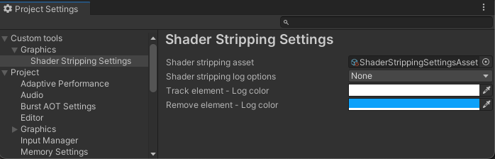

# com.v3gs.shaderstrippinghelper
This package is in charge of providing functionalities for stripping shaders and generate shader variants based on the information gather in the build proccess.

This package is built on top of the [IPreprocessShaders](https://docs.unity3d.com/ScriptReference/Build.IPreprocessShaders.html) interface. You can find more information about the shader stripping process in the following Unity blog post:
[Stripping scriptable shader variants](https://blog.unity.com/engine-platform/stripping-scriptable-shader-variants)

###### Current support: Unity 2021.3+

**How to add this package to your project**
* Load the project you want to use this package. Bear in mind the project must be created using Unity 2021.3+ or later.
* Open the add + menu in the Package Manager’s toolbar.
* Select Add package from git URL from the add menu. A text box and an Add button appear.
* Enter a Git URL that point out to this repository in the text box and click Add.

If you need additional steps for installing a package from a Git URL, [visit this guide](https://docs.unity3d.com/Manual/upm-ui-giturl.html).

**Project layout**
* `Runtime`: This folder constains the neccesary classes for storing information about [shaders](Runtime/ShaderInfo.cs), [reports](Runtime/ShadersCompilationReport.cs) and [stripping](Runtime/ShaderStripping). Based on this information, it will be generated the [ShaderStrippingReport](Runtime/ShadersCompilationReport.cs) and [ShaderVariantCollection](https://docs.unity3d.com/ScriptReference/ShaderVariantCollection.html) files. 
* `Editor` : This folder contains classes that only work in Unity's Editor. In there are relevant classes for rendering de Editor UI for this tool, and for performing the [IPreprocessShaders.OnProcessShader](https://docs.unity3d.com/ScriptReference/Build.IPreprocessShaders.OnProcessShader.html) operations.
* `Resources` : Folder that contains the Unity Extensible Markup Language (UXML) and [Unity Style Sheet (USS)](https://docs.unity3d.com/Manual/UIE-USS.html) files

# How to use?
Once you add this package via the _Package manager_ or by modifying the _manifest.json_ file, you required to create a couple of files.

## Shader Stripping Settings asset
You can create this asset by right clicking in the Project window, and select *_Create > Custom Tools > Shader Stripping > Settings asset_*.
You can create multiple of these assets and have different stripping settings according to your target platform needs.

Right now, you can:
* Stripping shader keywords
* Stripping shaders by name
* Track shader keyword
* Track shader assets by name

Bear in mind that you can modify the priority on demand by drag and drop the process at convenience.

Some additional options you can set up in the file are where you want to save the reports and Shader variant collection files.

## Shader Stripping Settings
This asset is automatically created when you open to the [Project Settings window](https://docs.unity3d.com/Manual/comp-ManagerGroup.html).

In this window, you will observe a new foldout structure: _Custom tools > Graphics > Shader Stripping Settings_.

In the _Shader stripping asset_ field, select the asset you want to use for your current stripping process. Also, in here you can specify the log options and the colors in which the logs will be prompted in the [Console window](https://docs.unity3d.com/Manual/Console.html).

> **Note**
> 
> Once you [build your Player](https://docs.unity3d.com/Manual/PublishingBuilds.html), this tool according the _Shader stripping asset_ will strip out shader keywords, shaders by name, generate a Shader Variant Collection, and log information of the elements removed/tracked.
